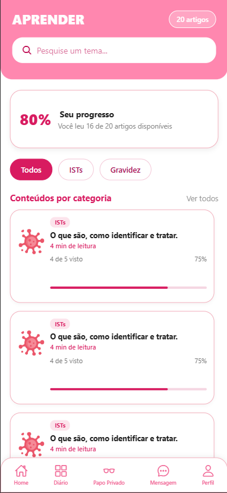

# Tela AprenderArtigos

Esta tela faz parte do aplicativo Vênus e permite que os usuários possam consultar os artigos disponíveis, acessar conteúdos confiáveis sobre a saúde da mulher e acompanhar seu progresso de leitura.

## Funcionalidades

- Progresso de leitura
- Apresentação de Artigos

## Tela

## Execução

- Compactar o projeto em ZIP.
- Descompactar em um diretório seguro na máquina (EX: Documentos).
- Executar o CMD e navegar para o diretório do projeto.
- Executar o comando npm start.
- Visualizar o projeto via Expo GO ou pressione W para renderizar no navegador.